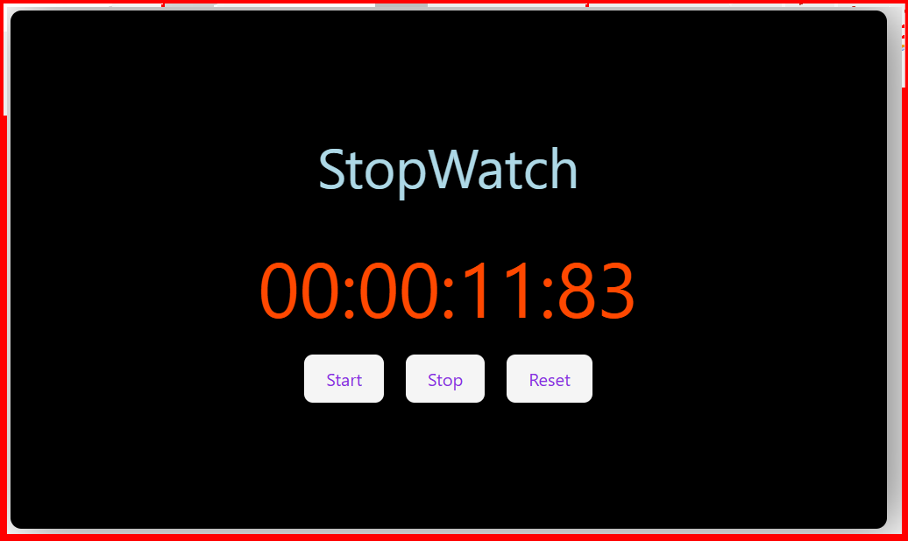

# React + Vite

This template provides a minimal setup to get React working in Vite with HMR and some Oxlint rules.

Currently, two official plugins are available:

- [@vitejs/plugin-react](https://github.com/vitejs/vite-plugin-react/blob/main/packages/plugin-react) uses [Oxc](https://oxc.rs)
- [@vitejs/plugin-react-swc](https://github.com/vitejs/vite-plugin-react/blob/main/packages/plugin-react-swc) uses [SWC](https://swc.rs/)

## React Compiler

The React Compiler is enabled on this template. See [this documentation](https://react.dev/learn/react-compiler) for more information.

Note: This will impact Vite dev & build performances.

## Expanding the Oxlint configuration

If you are developing a production application, we recommend using TypeScript with type-aware lint rules enabled. Check out the [TS template](https://github.com/vitejs/vite/tree/main/packages/create-vite/template-react-ts) for information on how to integrate TypeScript and Oxlint's TypeScript related rules in your project.

...existing code...

## Screenshots
 
 first of all open React-Topic folder and open Hooks folder and open the Project.jsx and project .css and App.jsx 

 how to run :- Open Terminal and cd React-Topics after that cd Hooks and after that cd UseEffect and after that run command npm run dev 

1 Digital Clock using useEffect in Hooks

2 Stopwatch using UseEffect in Hooks

