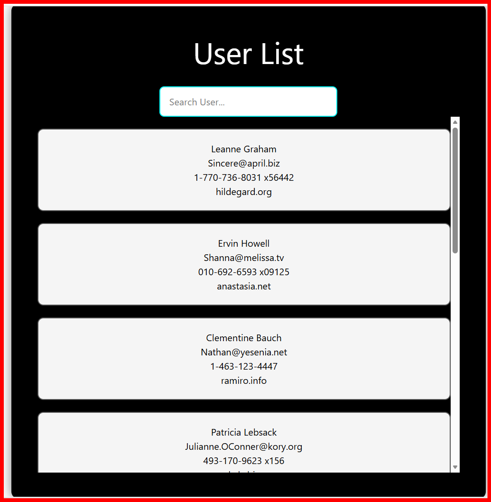

# 🌐 API Fetch with Search using React

A simple React project that fetches user data from the **JSONPlaceholder API** using **useEffect** and displays it in user cards. It also includes a **real-time search** feature to filter users by name.

## 🚀 Features

- Fetch user data from API
- Display users in responsive cards
- Search users by name
- Real-time filtering
- Scrollable user list
- Clean and responsive UI

## 🛠️ Technologies Used

- React
- Vite
- JavaScript (ES6+)
- CSS
- JSONPlaceholder API

## 📚 Concepts Learned

- useState
- useEffect
- API Fetch
- async / await
- fetch()
- JSON Data
- Array map()
- Array filter()
- String includes()
- Controlled Input
- Search Functionality

## 📡 API Used

https://jsonplaceholder.typicode.com/users

## 📸 Screenshot



## ▶️ How to Run

```bash
npm install
npm run dev
```

## 📂 Folder Structure

```
Api-Fetch
│── ApiFetch.jsx
│── ApiFetch.css
│── ApiFetch.png
│── README.md
```

## ✨ Future Improvements

- Search by Email
- Loading Spinner
- Error Handling
- User Details Modal
- Pagination

## 👨‍💻 Author

**Aakash**