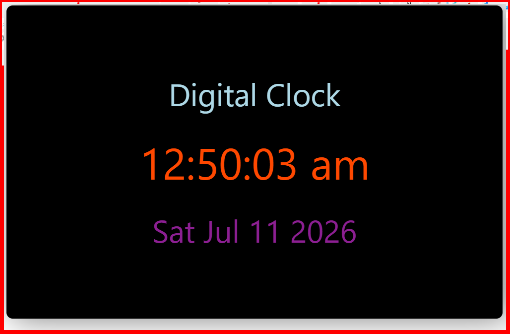

# ⏰ Digital Clock using React useEffect

A simple Digital Clock built with **React** using the **useEffect** and **useState** hooks.

## 🚀 Features

- Displays current time
- Updates automatically every second
- Displays current date
- Uses `setInterval()`
- Clears interval using cleanup function
- Responsive and clean UI

## 🛠️ Technologies Used

- React
- useState
- useEffect
- CSS

## 📚 Concepts Learned

- React Hooks
- useState
- useEffect
- setInterval()
- clearInterval()
- Cleanup Function
- Date Object

## 📸 Screenshot



## ▶️ Run Project

```bash
npm install
npm run dev
```

## 📂 Folder Structure

```
Digital-Watch
│── DigitalClock.jsx
│── DigitalClock.css
│── DigitalClock.png
│── README.md
```

## 👨‍💻 Author

**Aakash**